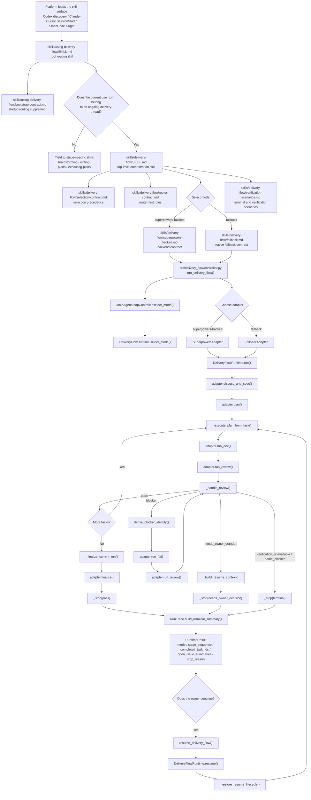

# Delivery Flow Architecture

[English](./architecture.md) | [简体中文](./architecture.zh-CN.md)

This document explains how the human-readable skill contracts in `skills/`
connect to the executable controller and runtime in `src/delivery_flow/`.

## Design Split

`delivery-flow` is intentionally split into three layers:

- `skills/`
  Agent-facing contract layer. These markdown files define routing rules,
  ownership rules, execution semantics, and stop conditions.
- `src/delivery_flow/`
  Executable controller and runtime layer. This layer turns the contract into a
  concrete state machine and owner-facing runtime result.
- `tests/`
  Contract-locking layer. Tests read the markdown files and validate that the
  code still implements the same promised behavior.

The runtime does not dynamically parse `SKILL.md` and interpret it at runtime.
Instead, the markdown defines the contract first, and the Python code encodes
that contract as explicit orchestration behavior.

## Call Flow

## How The Markdown And Runtime Cooperate

### 1. Root routing starts from markdown

The platform first exposes `skills/using-delivery-flow/SKILL.md`.

That file does not execute code directly. Instead, it tells the agent how to
make the routing decision at the start of the conversation and again on each
new user turn:

- take ownership for an ongoing delivery thread
- yield when only a single phase is needed
- avoid over-capturing work that belongs to stage-specific skills

Bootstrap-capable platforms may also inject
`skills/using-delivery-flow/bootstrap-contract.md` before any response, but
that bootstrap still points back to the same shared routing contract.

### 2. Execution semantics move from markdown into controller/runtime

Once the agent decides to enter `delivery-flow`, the execution contract defined
in `skills/delivery-flow/SKILL.md` is implemented by the controller and runtime.

The public handoff begins in
`src/delivery_flow/controller.py`:

- `run_delivery_flow()` starts a new run
- `resume_delivery_flow()` continues a stopped run
- `MainAgentLoopController.select_mode()` decides whether the execution backend
  is `superpowers-backed` or `fallback`

From there, `src/delivery_flow/runtime/engine.py` turns the contract into an
explicit state machine:

- `select_mode()` locks the execution mode
- `run()` starts the `discuss -> spec -> plan -> execute` lifecycle
- `_execute_plan_from_task()` advances one task at a time
- `_handle_review()` normalizes review outcomes and decides whether to pass,
  fix, stop, or wait for owner input
- `_finalize_current_run()` closes the run only after all tasks pass
- `resume()` restores the stopped lifecycle and continues from the correct task

### 3. Adapters preserve one owner-facing contract across backends

The adapters in `src/delivery_flow/adapters/` separate workflow semantics from
backend capability:

- `SuperpowersAdapter` uses a subagent-capable backend
- `FallbackAdapter` preserves the same workflow contract without those extra
  capabilities

This is why the repository can promise the same owner-facing delivery loop
across multiple capability levels even though the execution backend changes.

### 4. Trace turns runtime state back into owner-facing evidence

`src/delivery_flow/trace/run_trace.py` records stage transitions, execution
metadata, review events, issue actions, and resume events.

When a run stops, `RunTrace.build_terminal_summary()` converts internal runtime
state into the human-readable closeout summary returned in `RuntimeResult`, such
as:

- selected mode
- task progression
- open issues
- owner acceptance requirement
- stop reason

### 5. Tests keep docs and runtime aligned

The final coordination point is the test suite.

`tests/test_docs_contract.py` reads the markdown files directly and checks that
the required contract markers are still present. `tests/test_skill_contract.py`
and runtime tests then verify that the executable state machine actually
produces the same owner-facing behavior.

That means the repository uses this loop:

1. markdown declares the contract
2. Python code implements the contract
3. tests reject drift between the two

## Short Summary

If you need a one-line explanation:

`skills/*.md` decide what the workflow means, `src/delivery_flow/` decides how
it runs, and `tests/` make sure those two layers do not drift apart.
