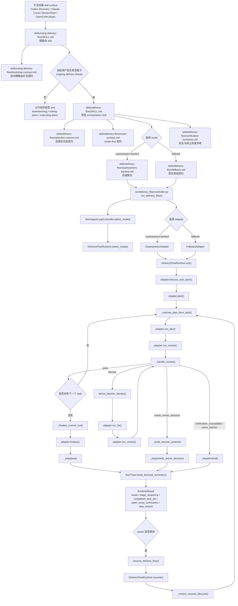

# Delivery Flow 架构说明

[English](./architecture.md) | [简体中文](./architecture.zh-CN.md)

这份文档解释 `skills/` 里的 markdown 合约，如何与
`src/delivery_flow/` 里的可执行 controller/runtime 协作。

## 分层设计

`delivery-flow` 故意拆成三层：

- `skills/`
  面向 agent 的合约层。这里的 markdown 定义路由规则、ownership 规则、
  执行语义和停止条件。
- `src/delivery_flow/`
  可执行的 controller/runtime 层。它把这些合约变成明确的状态机和
  owner-facing 结果。
- `tests/`
  合约锁定层。测试会直接读取 markdown，并验证代码是否仍在实现同一套
  承诺过的行为。

runtime 并不是在运行时动态解析 `SKILL.md`，再按自然语言执行。这里的
协作方式是：先由 markdown 定义 contract，再由 Python 代码把 contract
固化成明确的 orchestration 行为。

## 调用流程

## Markdown 和 Runtime 如何协作

### 1. 根路由从 markdown 开始

平台首先暴露 `skills/using-delivery-flow/SKILL.md`。

这个文件不会直接执行 Python 代码。它的职责是告诉 agent：在会话入口和
每个新的用户回合，应该如何做路由判断：

- 如果是持续交付线程，就接管
- 如果只需要单一阶段，就让行
- 避免把本来属于阶段型 skill 的请求全部吃掉

如果平台支持 bootstrap，还会在 before any response 阶段注入
`skills/using-delivery-flow/bootstrap-contract.md`，但它本质上仍然是在
强化同一套共享路由 contract。

### 2. 执行语义从 markdown 落到 controller/runtime

一旦 agent 决定进入 `delivery-flow`，`skills/delivery-flow/SKILL.md`
里定义的执行 contract 就会由 controller/runtime 落地。

公开入口从 `src/delivery_flow/controller.py` 开始：

- `run_delivery_flow()` 启动一次新运行
- `resume_delivery_flow()` 续跑一次已停止的运行
- `MainAgentLoopController.select_mode()` 决定使用
  `superpowers-backed` 还是 `fallback`

接下来，`src/delivery_flow/runtime/engine.py` 会把 contract 实现成显式
状态机：

- `select_mode()` 锁定执行 mode
- `run()` 启动 `discuss -> spec -> plan -> execute` 生命周期
- `_execute_plan_from_task()` 按 task 逐个推进
- `_handle_review()` 统一 review 结果，并决定 pass、fix、stop 或等待 owner
- `_finalize_current_run()` 只有在所有 task 都通过后才收尾
- `resume()` 恢复已停止的生命周期，并从正确位置续跑

### 3. Adapter 保持统一的 owner-facing contract

`src/delivery_flow/adapters/` 里的 adapter，把“工作流语义”和“后端能力”
拆开了：

- `SuperpowersAdapter` 面向具备 subagent 能力的后端
- `FallbackAdapter` 在没有这些能力时，保留同一套工作流 contract

这就是为什么这个仓库即使在不同能力层级下，也能对外承诺同一套
owner-facing delivery loop。

### 4. Trace 把内部状态重新翻译成可读证据

`src/delivery_flow/trace/run_trace.py` 会记录 stage transition、
execution metadata、review events、issue actions 和 resume events。

当运行终止时，`RunTrace.build_terminal_summary()` 会把内部 runtime 状态
重新整理成 `RuntimeResult` 中的可读 closeout summary，比如：

- 当前 mode
- task 推进情况
- open issues
- 是否需要 owner acceptance
- stop reason

### 5. 测试负责防止文档和代码分叉

最后一层协作点在测试。

`tests/test_docs_contract.py` 会直接读取 markdown，检查关键 contract 标记
是否还存在。`tests/test_skill_contract.py` 和 runtime 相关测试则负责验证
可执行状态机是否真的产生了这些文档承诺的 owner-facing 行为。

所以整个仓库形成的是这样一个闭环：

1. markdown 声明 contract
2. Python 代码实现 contract
3. tests 阻止两者发生漂移

## 一句话总结

如果要用一句话解释：

`skills/*.md` 负责定义“这套流程意味着什么”，`src/delivery_flow/`
负责定义“这套流程怎么运行”，`tests/` 负责保证两层不会分叉。
